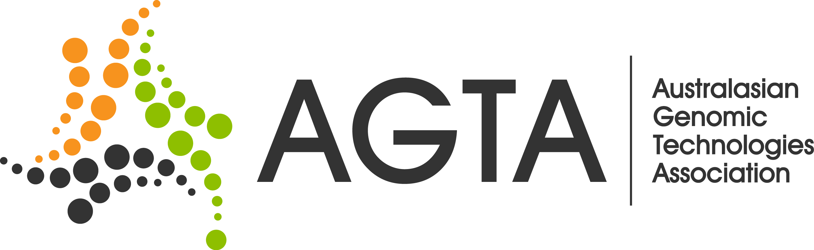

## Australasian Genomic Technologies Association Conference 2014

| B                | I                       | N                                                       | G                                                   | O                    |  
| :-----------:    | :-------------:         | :-------------:                                         | :-------------:                                     | :-------------:      |  
| De Novo Assembly |     Blatant typo              |        SNP                            | Junk DNA  |    Plot on cost of sequencing       |  
|PacBio     |Methylation  |          Unlabelled figure axis        |        Open-source software |      Photo of person in lab coat        |  
| "That's an interesting question"        |   AGRF or BGI             |  |           IGV screenshot                             | systems biology  |  
|  Bioinformatician    |     UCSC genome browser screen shot     |        mobile phone ringing              |    Excel  |    microarray         |  
|    FACS plot    |   Circos plot    |   [sequencing] depth         |               New 'ome                         |   Big Data    |  

